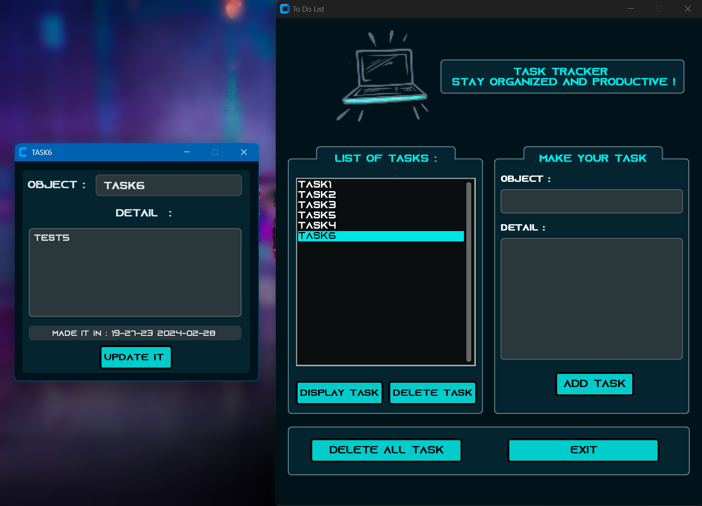
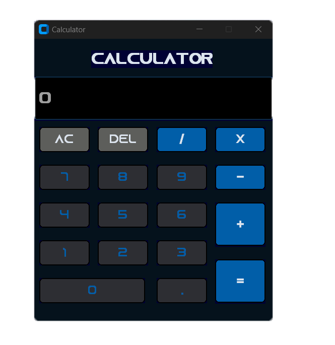
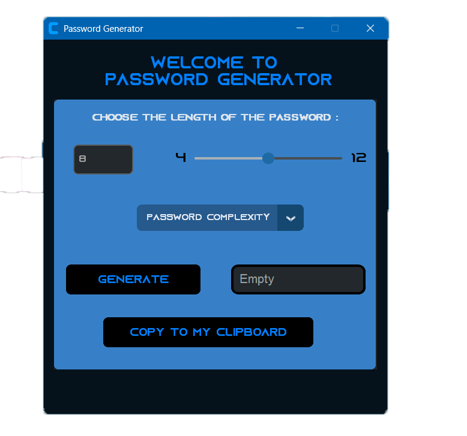

# CODESOFT Tasks :

## TASK 1 : To Do List

Python To-Do List app for managing tasks. Features include creation, update, and tracking. Available in CLI or GUI interface.

## TASK 2 : CALCULATOR

A Python calculator accepting user input for operands and operations separately, performing calculations based on chosen operations, and displaying results interactively.

## TASK 3  : PASSWORD GENERATOR

Python app generates strong, random passwords. Users specify length. Utilizes random characters. Displays generated password. User-friendly interface ensures seamless experience.

## Screenshots
## Task 1 :

## Task 2 :

## Task 3 :

 

## Authors

- [@ELhadratiOth](https://github.com/ELhadratiOth)

## Support

To Contact me :
Email Account : othmanelhadrati@gmail.com 
Linkden Account : Othman El HADRATI

